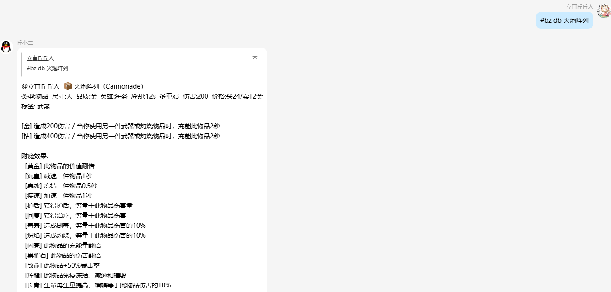

# 丘Bot (QiuBot)

基于 [NcatBot](https://docs.ncatbot.xyz/) 开发的 QQ 群机器人，专为 The Bazaar 中文社区设计。

## 截图预览

| 物品查询 | 胜率统计 |
|---------|---------|
|  |  |

**Web 查询页面**


---

## 功能概览

### 🎮 The Bazaar 插件（`#bz`）

The Bazaar 游戏数据查询，所有命令以 `#bz` 开头。

| 命令 | 说明 |
|------|------|
| `#bz help` | 查看帮助 |
| `#bz <物品名>` | 查询物品详情（支持中英文、模糊匹配） |
| `#bz skill <技能名>` | 查询技能详情 |
| `#bz search <关键词>` | 搜索物品/技能 |
| `#bz npc <名称>` | 查询 NPC/商人信息 |
| `#bz day <日期>` | 查询每日商店 |
| `#bz boss <名称>` | 查询 Boss 信息 |
| `#bz history <物品名>` | 物品胜率历史趋势图 |
| `#bz db <物品名>` | 查询 BazaarDB 社区数据 |
| `#bz runs <筛选条件>` | 查询玩家阵容记录 |
| `#bz winrate <物品名>` | 卡牌 10 胜率统计（支持多卡 + 组合、指定英雄、--days N） |
| `#bz partner <物品名>` | 卡牌搭档出现率分析 |
| `#bz alias <设置/查看>` | 自定义卡牌别名 |
| `#bz watch <用户名>` | 订阅玩家战绩推送 |
| `#bz unwatch <用户名>` | 取消订阅 |
| `#bz watchlist` | 查看订阅列表 |

**示例：**
```
#bz 火炮阵列
#bz winrate 火炮阵列+赛博铁尺 海盗 --days 7
#bz partner 武装核心
#bz watch PlayerName
```

### 📝 群聊总结

`@bot 总结最近 X 小时 / 总结今天 / 总结昨天`

由 Claude AI 驱动，按话题分组总结群聊内容，每群每 60 秒最多触发一次，最长支持 24 小时。

### 💬 @对话（可选）

@bot 直接对话，由 Claude AI 回复。默认关闭，可在 `chat_plugin.py` 中设置 `CHAT_ENABLED = True` 开启。

### 🤖 基础功能

- 自我介绍：发送「你是谁」触发
- RBAC 权限系统：支持 user / admin / root 多级权限

---

## Web 查询页面

胜率/阵容查询页面运行在服务器 1027 端口，支持按英雄、物品、时间筛选。

---

## 环境要求

- Python >= 3.10
- NcatBot（WebSocket 模式）
- NapCat（QQ 协议端）

## 部署

```bash
git clone https://github.com/CodeHuba/QiuBot.git
cd QiuBot
python -m venv venv
source venv/bin/activate
pip install -r requirements.txt
python main.py
```

配置文件：`config.yaml`

```yaml
napcat:
  ws_uri: ws://localhost:3002
  ws_token: <token>
```

服务以 systemd 管理：

```bash
sudo systemctl start/stop/restart qiubot
sudo journalctl -u qiubot -f
```

## 项目结构

```
QiuBot/
├── main.py
├── config.yaml
├── plugins/
│   ├── bazaar_plugin/
│   │   ├── bazaar_plugin.py         # 指令路由与响应
│   │   ├── gamedata_client.py       # 本地 GameData.db 查询
│   │   ├── bazaardb_client.py       # BazaarDB 社区数据 API
│   │   ├── runs_query.py            # 玩家阵容/胜率查询
│   │   ├── translations.py          # 中英文翻译
│   │   ├── formatter.py             # 卡牌信息格式化
│   │   ├── chart.py                 # 胜率图表生成
│   │   ├── subscriptions.py         # 玩家订阅推送
│   │   └── cache/
│   ├── summary_plugin/              # 群聊总结（Claude AI）
│   ├── chat_plugin/                 # @对话（Claude AI，默认关闭）
│   ├── qiu_plugin/                  # 基础指令
│   └── dev_plugin/                  # 开发调试
├── data/
│   ├── bazaar_runs.db               # 玩家阵容数据库
│   ├── card_id_mapping.json
│   └── rbac.json
└── web_runs/                        # Web 查询页面（Flask，1027 端口）
```

## 相关链接

- [NcatBot 文档](https://docs.ncatbot.xyz/)
- [BazaarDB](https://bazaardb.gg/)
- [The Bazaar](https://www.howbazaar.gg/)
